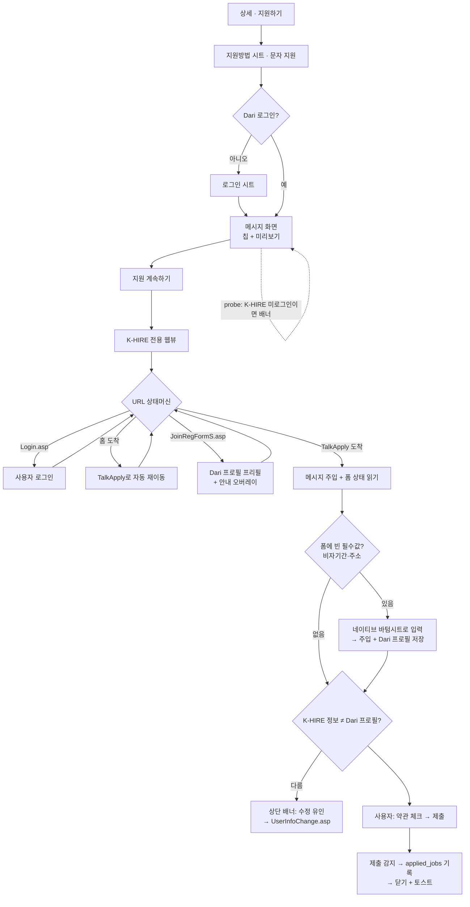

# 문자 지원(K-HIRE TalkApply) 설계안 — v2 (2026-10-04 개정)

2026-09-26 초안(덤프 5종) + 2026-10-04 확정분 반영:
공고명 문장 삭제 / 400자 / 칩 기본값=공고 정보 / 미리보기 한국어만·편집불가 / 약관 수동 / 기록=제출감지+백업팝업 / 로그인 후 홈 리다이렉트 대응 / 가입화면 프리필 / **추가정보는 웹뷰 도착 후 just-in-time 수집(오버레이)** / 불일치 수정 유인

---

## 1. 전체 흐름



핵심 원칙:
- **Dari 프로필이 원본(master)** — 사이트 쪽 정보가 다르면 사용자가 사이트에서 고치도록 유인
- 추가정보(비자기간·주소)는 미리 안 받음 — **TalkApply 폼에서 실제로 비어 있을 때만** 웹뷰 위 바텀시트로 수집, 입력값은 프로필에도 저장(다음부턴 안 물음)
- 전용 웹뷰 = 단순 브라우저가 아닌 **가이드 레이어**: 상황 감지 → 네이티브 오버레이(시트/배너)로 돕기
- 제출·약관·인증은 전부 사용자가 직접 (자동화 안 함)

---

## 2. 메시지 화면 (구 준비 화면 — 축소)

풀스크린 push. 칩 + 미리보기만. (추가정보 섹션 삭제 — 웹뷰 오버레이로 이동)

```
┌─────────────────────────────┐
│ ←  문자 지원                 │
├─────────────────────────────┤
│ ⓘ 다음 화면에서 K-HIRE 로그인이│ ← probe 미로그인일 때만
│    필요해요                   │
├─────────────────────────────┤
│ 지원 메시지 만들기             │
│  한국어 수준                  │
│  (잘해요)(보통)(조금)(배우는 중) │
│  경력                        │
│  (처음)(1년 미만)(1~3년)(3년 이상)│
│  근무 가능 요일 ← 공고 정보 프리셀렉트
│  (모두 가능)(평일만)(주말만)(협의)│
│  근무 가능 시간 ← 공고 정보 프리셀렉트
│  (모두 가능)(오전)(오후)(저녁·야간)(협의)│
│  시작 가능일                  │
│  (바로 가능)(1주일 이내)(협의)   │
│ 미리보기 (한국어, 읽기 전용)     │
│ ┌─────────────────────────┐ │
│ │ 안녕하세요. 저는 방글라데시   │ │
│ │ 국적이고 E-9 비자가 있습니다…│ │
│ └─────────────────────────┘ │
│                     142/400자│
├─────────────────────────────┤
│ [ K-HIRE에서 지원 계속하기 ]   │
└─────────────────────────────┘
```

- 칩 기본값: 요일·시간=해당 공고(work_schedule, work_start/end_time), 한국어=프로필, 나머지=SMS 관리 저장값(없으면 미선택)
- 미리보기 = 실제 주입본. 자유 편집 불가, **편집 = 칩 조정**
- **마이페이지 "문자"(SMS 관리) 화면과 칩+미리보기 위젯 공유** — SMS 관리에서 기본 문구 설정·수정, 메시지 화면은 그 값을 기본값으로 로드

---

## 3. 표준 문구 조립 규칙 (7→6블록)

전송문은 한국어 고정(번역본 없음). 칩 라벨·화면 문자열만 16개 언어 번역.

| # | 블록 | 템플릿 | 소스 |
|---|------|--------|------|
| 1 | 인사 | `안녕하세요.` | 고정 (공고명 문장 삭제 — TalkApply가 공고에 묶여 있음) |
| 2 | 자기소개 | `저는 {국적} 국적이고 {비자코드} 비자가 있습니다.` | Dari 프로필 |
| 3 | 한국어 | 4단계 문장 | 칩 |
| 4 | 경력 | `이런 일은 처음이지만 성실하게 배우겠습니다.` / `비슷한 일을 {1년 미만\|1~3년\|3년 이상} 해본 경험이 있습니다.` | 칩(선택=기간) |
| 5 | 근무가능 | `{요일}에 {시간} 근무 가능합니다.` / 모두 가능: `요일과 시간 모두 맞출 수 있습니다.` / 협의 포함: `근무 요일과 시간은 협의 가능합니다.` | 칩 2개 |
| 6 | 시작일 | `바로 출근할 수 있습니다.` 등 3종 — "바로 가능" 시 `#gotoworkyn` 체크 동반 | 칩 |
| 7 | 맺음 | `연락 주시면 감사하겠습니다.` | 고정 |

- 미선택 블록 생략 / **400자 제한**(주입 시 페이지 실제 제한값도 읽어 재확인) / 최악 조합 단위테스트 assert

---

## 4. 프로필 확장 (DB)

`applicant_profiles` 컬럼 추가 (저장 시점 = 웹뷰 바텀시트 입력 순간):

| 컬럼 | 타입 |
|------|------|
| `visa_issued_at` / `visa_expires_at` | date null |
| `visa_no_expiry` | boolean default false (F-5 영주권) |
| `addr_sido` / `addr_sigungu` / `addr_dong` | text null |
| (SMS 관리) 칩 기본값 저장 | jsonb 또는 개별 컬럼 — 구현 시 확정 |

- 내정보(개인정보 수정)에서 비자기간·주소 조회·수정 가능

---

## 5. 전용 웹뷰: 상태머신 + 오버레이 가이드

`khire_apply_webview_screen.dart` 신설 (일반 지원 웹뷰 무영향).

### URL 상태머신

| URL | 동작 |
|-----|------|
| `login/Login.asp` | 무동작 (사용자 로그인) |
| 홈 `m.khire.co.kr/` | **TalkApply(adid)로 자동 재이동** (로그인 후 홈으로 떨어지는 것 실기기 확정) |
| `JoinRegFormS.asp` (가입) | Dari 프로필 프리필: usernm/nationtype/nationcd/visacd/visasdt·edt/생년월일/성별/htel/email — 인증 2종·약관은 미개입. 오버레이 안내: "정보를 채워뒀어요. 휴대폰 인증만 진행하세요" |
| `TalkApply.asp` | 주입 + 폼 읽기 (아래) |
| 그 외 | 무동작 (흐름 안 깨짐) |

### TalkApply 도착 시

1. `#comment`에 메시지 주입 + 글자수 카운터 갱신
2. **폼 상태 읽기**: visasdt/visaedt 값, 주소 select 상태, 표시된 회원정보(이름/비자/연락처)
3. **빈 필수값 있으면** (비자기간·주소) → 네이티브 바텀시트 (웹뷰 위):
   - 프로필에 값 있으면 묻지 않고 바로 주입
   - 없으면 입력받아 → 주입 + 프로필 저장. 영주권 "만료일 없음" 체크 포함
   - 주소: `#selSi→#selGu→#selDong` 텍스트 매칭+change 디스패치, 3초 폴링, 실패 단계만 수동 폴백(안내 토스트)
4. **불일치 감지**: 폼의 회원정보 ≠ Dari 프로필 → 상단 배너 "K-HIRE에 등록된 정보가 프로필과 달라요 [수정하기]" → `UserInfoChange.asp` 이동 (수정은 사용자 직접, 저장 시 비밀번호 요구 여부 실기기 확인)
5. 유의사항 레이어는 그대로 노출 (스킵 안 함, 폼은 DOM에 있어 주입 무영향)

**자동으로 하지 않는 것**: 약관(#privacyAgreeAll), 제출, 유의사항 확인, 휴대폰·이메일 인증.

---

## 6. 지원 기록 연동

- v1 감지: 제출 클릭 리스너 + 직후 페이지 전환 = 완료 → `record(method: 'sms')` + 토스트 + 닫기. 첫 실제출에서 완료 URL 확보 → URL 매칭으로 전환
- 백업: 감지 실패로 닫으면 "문자로 지원하셨나요?" 확인 팝업 (PendingApplyService 재사용)
- 2차: ApplicationList.asp 파싱으로 전체 지원 동기화

---

## 7. 엣지 케이스

| 케이스 | 처리 |
|--------|------|
| 이력서 필수 공고 얼럿 | K-HIRE 그대로 노출, 앱 개입 없음 |
| K-HIRE 계정 없음 | 가입 화면 프리필 + 안내 오버레이 (인증은 직접) |
| 세션 만료 | Login.asp 리다이렉트 → 상태머신 자연 처리 |
| 주소 매칭 실패 | 해당 select만 수동, 안내 |
| F-5 영주권 | 만료일 "없음" — K-HIRE 폼이 만료일 필수일 때 처리 실기기 확인 |
| 별도 '미입력자 정보 입력 화면' | 없는 것으로 결론 (가입 때 수집 + 부족분은 TalkApply가 요구) — 나와도 무동작으로 통과 |

---

## 8. 구현 순서

1. DB: `applicant_profiles` 컬럼 추가 (4장)
2. `sms_message_builder.dart` + 단위테스트 (칩 조합→문장, 생략, 400자)
3. `app_strings.dart` — 칩 라벨·화면 문자열 16개 언어 (전송문은 한국어 고정이라 번역 없음)
4. 메시지 화면 + SMS 관리 공유 위젯 (probe 배너 포함)
5. `khire_apply_webview_screen.dart` — 상태머신 + 주입 + 오버레이(JIT 시트/불일치 배너/가입 안내)
6. 지원방법 시트 `sms` 연결 (K-HIRE 공고만)
7. 실기기: 우미양 공고 제출 1회 → 완료 URL 확보 → 기록 확정

---

## 9. 확정 로그 (2026-10-04)

편집 불허(칩만) / 약관 수동 / 기록=제출감지+백업팝업 / 공고명 문장 삭제 / 400자 / 칩 기본값=공고 정보 / 미리보기 한국어만 / 추가정보 강제 안 함 → **웹뷰 JIT 수집으로 이전** / Dari 프로필=원본, 사이트 불일치는 수정 유인 / SMS 관리와 위젯 공유
